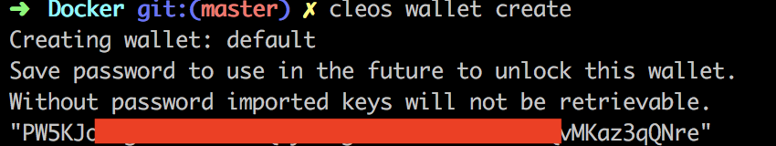
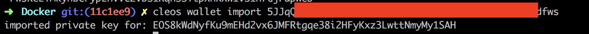
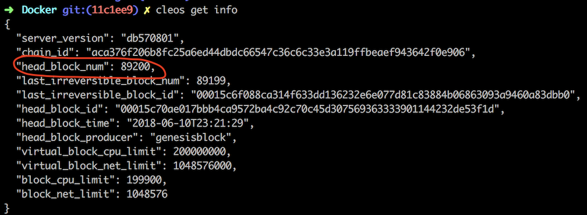
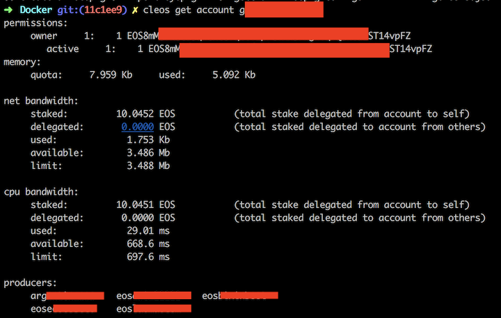

## How To Vote
* Open your terminal and cd your workspace

* Run `git clone https://github.com/EOSLaoMao/eos-local-voter.git && cd ./eos-local-voter/Docker`

* Run container `./run-docker.sh && docker ps`

* Excute command `alias cleos="docker exec full-node cleos"` on your current tty, or add this command to .bashrc or other shell rc file and source it.

* Create Wallet : `cleos wallet create`, Please save your wallet password in a security place. Please note: wallet will be auto locked by keosd after 15 minutes of inactivity. Use `cleos wallet unlock --password=[walletPassword]` to unlock it.

* `cleos import [privateKey]`

* `cleos get account [accountName]` to check your account info 

* Get blockchain info `cleos get info` 

 
* After head block number reach the latest, you can vote with this command `cleos system voteproducer prods [bpName]`

* `cleos get account [accountName] ` to check vote status

